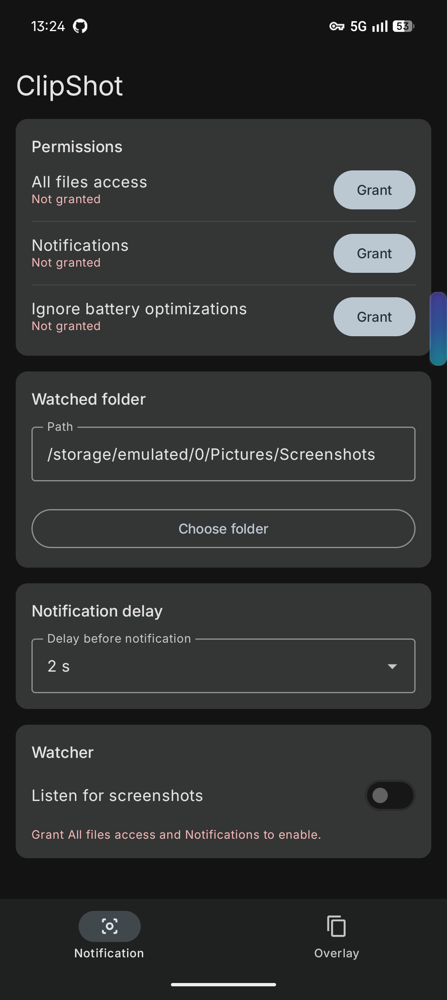

# ClipShot

I take a screenshot, paste it somewhere, and then my gallery is full of junk I never wanted to keep. ClipShot fixes that: it watches the screenshot folder, and when a new one shows up it offers to copy it to the clipboard and delete the file. One tap, nothing left behind.



## Two ways to use it

**Notification mode.** A background service watches the folder. When a screenshot lands you get a notification with *Delete* and *Copy & Delete*. You can add a delay (0–10 seconds) so it doesn't fire before you're done looking at the thing.

**Overlay mode.** An accessibility service notices the screenshot instead, and a small floating button slides in next to the system preview. Tap it and the screenshot is on your clipboard and gone from disk. Drag the button wherever you like — it stays there.

The two modes are independent, so pick whichever fits.

## Permissions, and why

- **All files access** — to read and delete files in the screenshot folder.
- **Notifications** — to show the notification with the action buttons.
- **Ignore battery optimizations** — otherwise Android kills the watcher after a while.
- **Display over other apps** — the floating button (overlay mode only).
- **Accessibility service** — how overlay mode learns a screenshot was taken (overlay mode only).

Nothing leaves the device. There's no network permission at all.

## Building it

```sh
./gradlew assembleDebug
./gradlew installDebug
```

Kotlin and Jetpack Compose with Material 3. minSdk 24, targetSdk 36.
